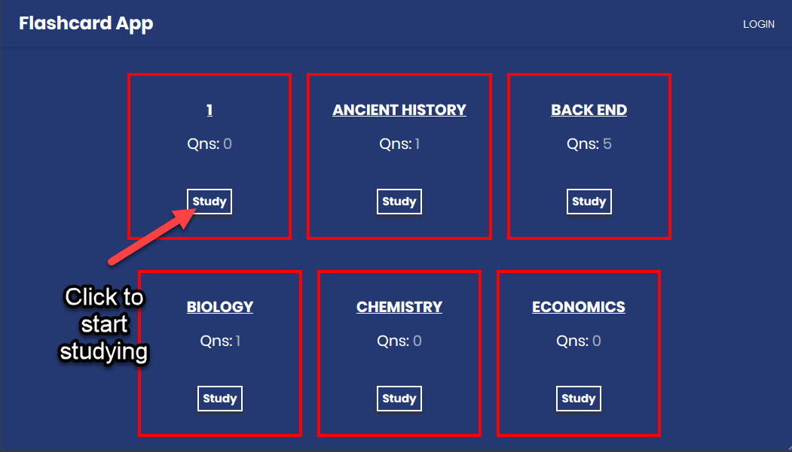
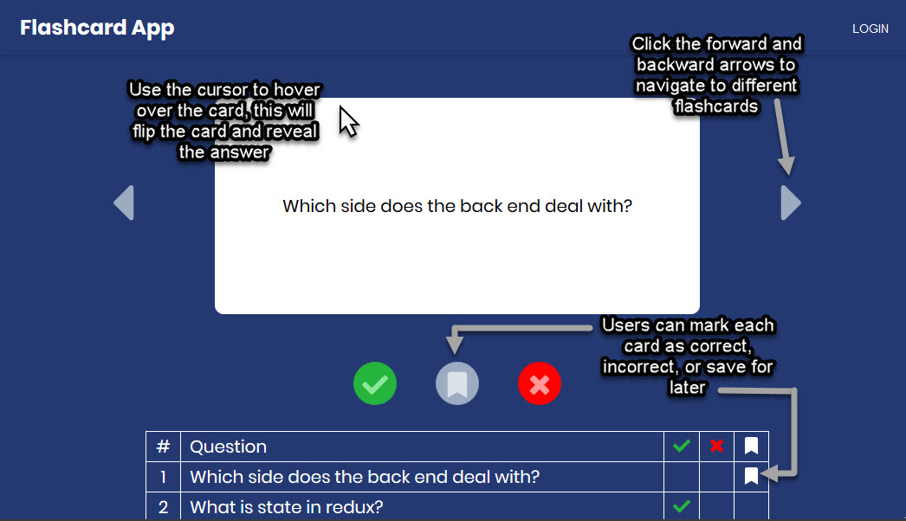
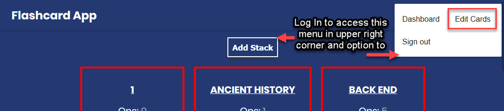
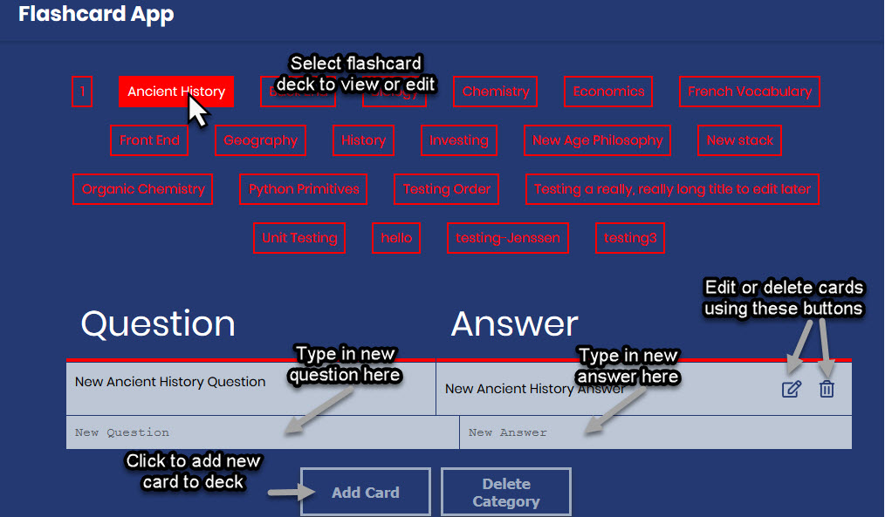

# Flashcard App

## What this app does
The Flashcard App allows users to study flashcards online. Users can study flashcard stacks made by other users or stacks they themselves have created. Furthermore, users can edit, add, or delete their own flashcard stacks.

# How to:
## Get Started
Clicking on the "Take a Look" button will take the user to the flashcard dashboard. From there, the user can explore and study pre-existing flaschard stacks.

### **Flashcard Dashboard**
The dashboard is where all users' flashcard stacks are accessible. Any user can study from any other user's flashcard stacks. Clicking the "Study" button will take the user to the study page.

### **Study Page**
The study page is where the user can navigate through the cards in a deck of flashcards. The user can quiz themselves and mark a card as correct, incorrect, or bookmark for later. By hovering over the card, the user can reveal the answer on the back side of the card.

### **Logged In Features**
Logging in gives the user a menu in the upper right corner of the app. The menu allows the user to navigte to flashcard dashboard as well as a page where they can edit their flashcard decks. Once logged in, the user can also add a flashcard deck from the dashboard page by clicking "Add Stack".

### **Edit Flashcards**
Once logged in, the user can click the "Edit Cards" option in the navigation menu to take them to a page where they can edit their own flashcards as well as look at the full decks made by other users.

***

# Tech Stack
* Front End: React, Redux, Material UI, Sass, CSS Grid, Flexbox
* Back End: MongoDB, Express, Node.js, Passport.js, Auth0, Mocha
* Tools: Git, Trello, Slack

# Future Goals:
* Add a quizzing feature where a user can keep track of their highest scores and performance

<!-- Voyage-4 -->

<!-- * `git clone` repo
* Jump into the `development` branch. `git checkout development`
* Get latest code from develoment. `git pull`
* Make your own feature branch `git checkout -b <your branch name>` from `development`
* Fetch latest code again before pushing your branch.
  1. Commit or stash your changes
  2. `git checkout development`
  3. `git pull`
  4. `git checkout <your branch name>`
  5. `git merge development`
  6. Fix any conflicts
  7. Push your new branch
* Make a pull request from your new branch against the `development` branch -->